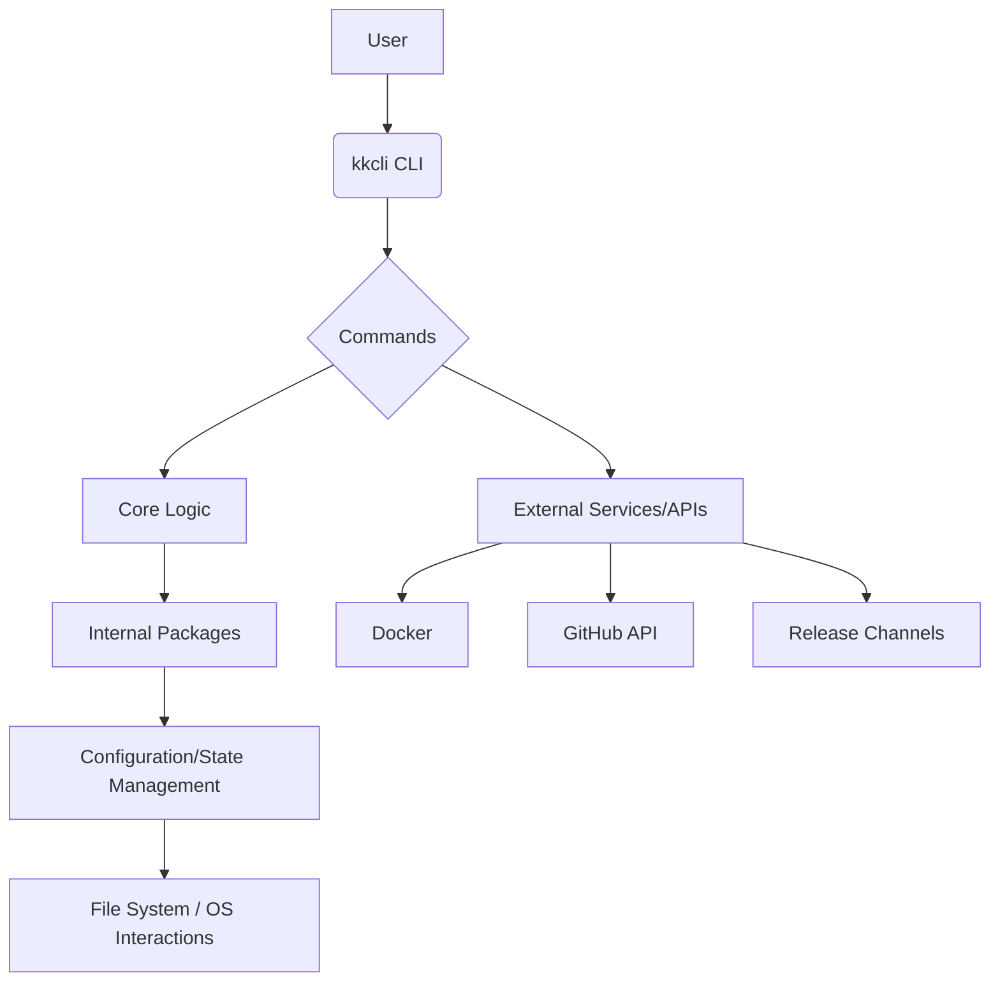

# System Architecture

The `kkcli` project is designed as a command-line interface (CLI) tool primarily written in Go, focusing on efficiency, portability, and ease of use. Its architecture emphasizes modularity to allow for easy extension and maintenance.

## Key Architectural Components

### 1. CLI Entry Point (`cmd/kkcli.go`)

*   The main entry point for the application, responsible for parsing command-line arguments and dispatching to appropriate subcommands.
*   Utilizes a CLI framework (e.g., Cobra) for command definition, flag parsing, and help generation.

### 2. Commands (`cmd/`)

*   Each top-level command (e.g., `update`, `completion`) is encapsulated within its own file or directory under `cmd/`.
*   Commands are responsible for:
    *   Defining their specific arguments and flags.
    *   Orchestrating the business logic by calling functions from `pkg/` or other internal modules.
    *   Handling user interaction (input, output).

### 3. Internal Packages (`pkg/`)

*   **Updater Package (`pkg/updater/`)**:
    *   **Purpose**: Manages the application's self-update mechanism.
    *   **Functionality**:
        *   Checks for new versions of `kkcli`.
        *   Downloads new binaries or images securely (e.g., using checksum verification).
        *   Manages the replacement of the current `kkcli` installation.
        *   Interacts with external release channels (e.g., GitHub Releases) to fetch release information.
    *   **Dependencies**: May interact with Docker for image-based updates or directly with the file system for binary replacement.

### 4. Build and Release Infrastructure

*   **Makefile**:
    *   **Purpose**: Standardizes and automates build tasks.
    *   **Role**: Defines targets for compiling the `kkcli` binary, running tests, cleaning artifacts, and potentially invoking other build-related scripts.
*   **GoReleaser (`.goreleaser.yml`)**:
    *   **Purpose**: Automates the entire release process.
    *   **Role**: Configures the creation of cross-platform binaries, archives, checksums, and GitHub releases. It ensures consistent and secure releases.

### 5. CI/CD Pipeline (`.github/workflows/ci.yml`)

*   **Purpose**: Ensures code quality, automates testing, and streamlines deployment.
*   **Role**:
    *   **Continuous Integration**: Automatically builds and tests the `kkcli` project on every push to the repository.
    *   **Continuous Deployment**: Integrates with GoReleaser to automate the creation and publishing of new releases when specific conditions are met (e.g., tag pushes).
    *   **Tools**: Leverages GitHub Actions for workflow orchestration.

### 6. Installation Script (`scripts/install.sh`)

*   **Purpose**: Provides a secure and user-friendly way to install `kkcli`.
*   **Role**: Downloads the correct `kkcli` binary for the user's system, performs checksum verification to ensure integrity, and places the binary in a runnable path.

## Data Flow (Update Command Example)

1.  **User executes `kk update`**: The CLI dispatches the call to the `update` command handler in `cmd/update.go`.
2.  **Version Check**: The `update` command calls the `updater` package (`pkg/updater/updater.go`) to check for the latest `kkcli` version. This typically involves making an HTTP request to a release API (e.g., GitHub Releases).
3.  **User Confirmation**: If a new version is found, the `update` command prompts the user for confirmation.
4.  **Download & Verify**: Upon confirmation, the `updater` package downloads the new `kkcli` binary (or Docker image) and verifies its integrity using a checksum.
5.  **Installation**: The `updater` replaces the old `kkcli` binary with the new one (or updates the Docker image), ensuring a seamless transition.
6.  **Completion**: The `update` command reports the success or failure of the update to the user.

## Future Considerations

*   **Plugin Architecture**: As `kkcli` grows, a plugin architecture could allow for dynamic extension of functionality without modifying the core codebase.
*   **Configuration Management**: Centralized and version-controlled configuration for more complex features.
*   **Telemetry**: Opt-in telemetry for usage analytics to guide future development.