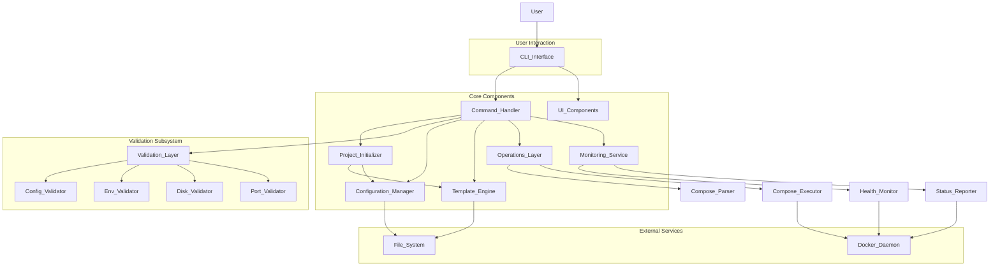

# System Architecture - kkcli

## 1. High-Level Architecture

The `kkcli` is a command-line interface (CLI) tool designed to streamline the management of Docker Compose applications. Its architecture is organized into several key layers, promoting modularity, maintainability, and extensibility.

## 2. Architectural Layers

### 2.1. CLI Interface (`cmd/`, `pkg/ui/`)

-   **Responsibility**: Handles user input, parses commands and arguments, and presents output.
-   **Components**:
    -   `main.go`: Application entry point.
    -   `cmd/`: Defines the available CLI commands (e.g., `init`, `start`, `status`, `restart`).
    -   `pkg/ui/`: Provides utilities for interactive prompts, password handling, and formatted output.

### 2.2. Command Handler (`cmd/`, `main.go`)

-   **Responsibility**: Routes parsed commands to the appropriate business logic components.
-   **Interaction**: Acts as an orchestrator, coordinating calls to various services based on the executed command.

### 2.3. Project Initializer (`pkg/init/` - conceptual)

-   **Responsibility**: Sets up new `kkcli` projects, generating necessary configuration files and directory structures.
-   **Interaction**: Utilizes the Template Engine and Configuration Manager.

### 2.4. Validation Layer (`pkg/validator/`)

-   **Responsibility**: Ensures the operating environment and project configurations meet predefined requirements before critical operations are executed.
-   **Components**:
    -   `preflight.go`: Orchestrates and executes various validation checks.
    -   `config.go`: Validates `kkcli` and Docker Compose configuration files.
    -   `env.go`: Checks for required environment variables.
    -   `disk.go`: Verifies disk space and file system permissions.
    -   `ports.go`: Detects port conflicts.
    -   `errors.go`: Custom error handling for validation failures.

### 2.5. Configuration Manager (`pkg/config/` - conceptual)

-   **Responsibility**: Manages loading, parsing, and persisting `kkcli`'s configuration settings.
-   **Interaction**: Provides structured access to configuration data for other components.

### 2.6. Template Engine (`pkg/templates/`)

-   **Responsibility**: Generates various configuration files (e.g., `docker-compose.yml`, Caddyfile) from templates.
-   **Components**:
    -   `embed.go`: Embeds template files into the Go binary.
    -   Specific `.tmpl` files: Define the structure and content of generated configurations.

### 2.7. Operations Layer (`pkg/compose/`)

-   **Responsibility**: Manages core Docker Compose operations such as starting, stopping, and restarting services. It abstracts the complexities of interacting with the Docker daemon.
-   **Components**:
    -   `executor.go`: Handles the execution of Docker Compose commands and interactions with the Docker Engine API.
    -   `parser.go`: Responsible for parsing `docker-compose.yml` files and other related configurations.
-   **Interaction**: Directly interacts with the Docker Daemon via the Docker SDK.

### 2.8. Monitoring Service (`pkg/monitor/`)

-   **Responsibility**: Collects and displays real-time status and health information from Docker Compose services.
-   **Components**:
    -   `health.go`: Implements checks to determine the health status of individual services.
    -   `status.go`: Gathers and aggregates status information for all services in a Docker Compose project.
-   **Interaction**: Interacts with the Docker Daemon to retrieve service status and health.

### 2.9. UI Components (`pkg/ui/`)

-   **Responsibility**: Provides a consistent and user-friendly interface for displaying progress, tabular data, and general output to the console.
-   **Components**:
    -   `progress.go`: Manages progress bars and indicators for long-running operations.
    -   `table.go`: Renders data in well-formatted tables for clear presentation.
-   **Interaction**: Used by various layers to present information to the user.

## 3. Data Flow

1.  **User Input**: A user executes a `kkcli` command in the terminal.
2.  **CLI Parsing**: The `CLI Interface` (using `main.go` and `cmd/`) parses the command and its arguments.
3.  **Command Execution**: The `Command Handler` receives the parsed command.
4.  **Pre-flight Validation**: For critical operations, the `Command Handler` invokes the `Validation Layer`.
    -   The `Validation Layer` runs checks (config, env, disk, ports) using its internal components.
    -   Validation results (success/failure, detailed errors) are returned.
5.  **Logic Execution**: If validation passes (or if the command doesn't require validation), the `Command Handler` calls the relevant core components:
    -   `Project Initializer`: for `init` commands.
    -   `Operations Layer`: for `start`, `stop`, `restart` commands.
    -   `Monitoring Service`: for `status` commands.
    -   `Configuration Manager`: for reading/writing `kkcli` settings.
    -   `Template Engine`: for generating files.
6.  **External Interaction**: The `Operations Layer` and `Monitoring Service` interact with the `Docker Daemon` to manage and inspect containers. The `Configuration Manager` and `Template Engine` interact with the `File System`.
7.  **Output**: Results, status messages, and progress are formatted by `UI Components` (using `pkg/ui/`) and presented back to the user via the `CLI Interface`.

## 4. Key Design Principles

-   **Modularity**: Clear separation of concerns into distinct packages.
-   **Extensibility**: Easy to add new commands, validation checks, or template types.
-   **User-Centricity**: Prioritizing clear feedback and ease of use.
-   **Robustness**: Emphasizing validation and comprehensive error handling.
-   **Idempotency**: Operations should produce the same result if applied multiple times (where applicable).